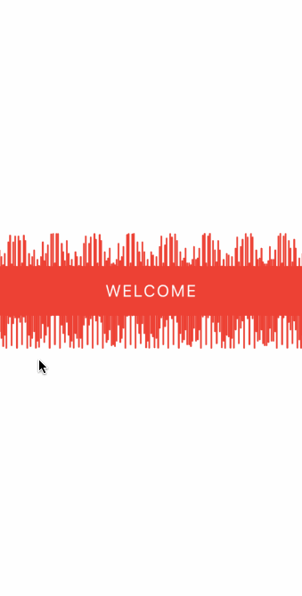

# React-native-wave-view

Simple butter-smooth animated wave view library for react-native.
It is bootstrapped with [Create React Native App](https://github.com/react-community/create-react-native-app).

## Demo

| ----------------------------------- | ------------------------------------ |
|  |  |

## Dependencies

- React Native

## To use this package

**1. Add this to packgage.json of your project under dependencies key**

> $"react-native-wave-view":"github:shubham56/react-native-wave-view"

**2. Run the following command in your project directory**

> $ npm install

**3. How to use**

> import WaveView from "react-native-wave-view";

**PROPS**

| Name          | Type          | Default |
| ------------- | ------------- | ------- |
| height        | number        | 200     |
| width         | number        | 376     |
| waveColor     | color(string) | 'blue'  |
| waveSpeed     | string (fast  | slow)   | number(ms) | 'slow' |
| waveAmplitude | number        | 10      |
| noOfWaves     | number        | 100     |
| wavePosition  | string (top   | bottom  | both) | both |
| style         | style object  | {}      |
| children      | React Node    | null    |

```javascript
<WaveView
  height={200}
  width={width}
  waveColor={'red'}
  waveSpeed={'slow'}
  waveAmplitude={20}
  noOfWaves={80}
  wavePosition={'both'}
  style={{ alignItems: 'center', justifyContent: 'center' }}
>
  <Text>My text goes here</Text>
</WaveView>
```

## Credits

[ReactNative](https://facebook.github.io/react-native/)

[Expo](https://expo.io)
